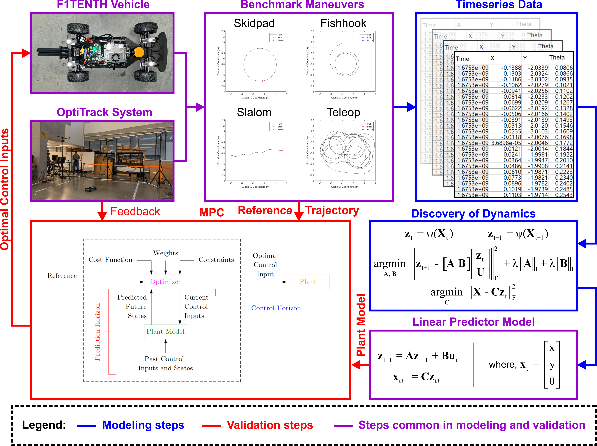
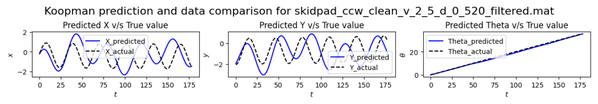
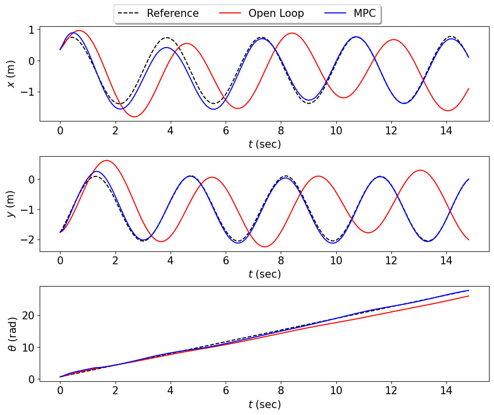
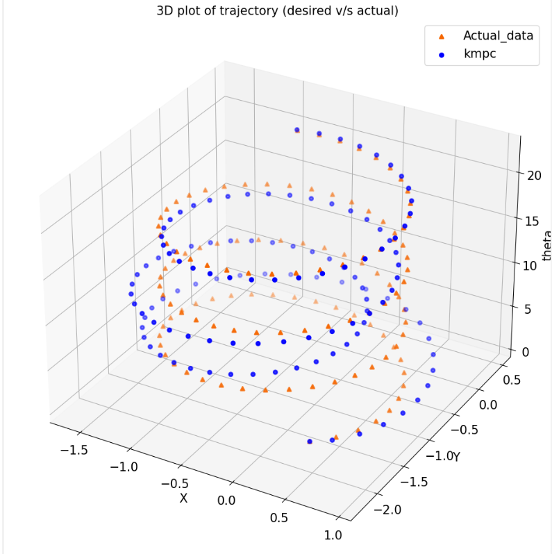
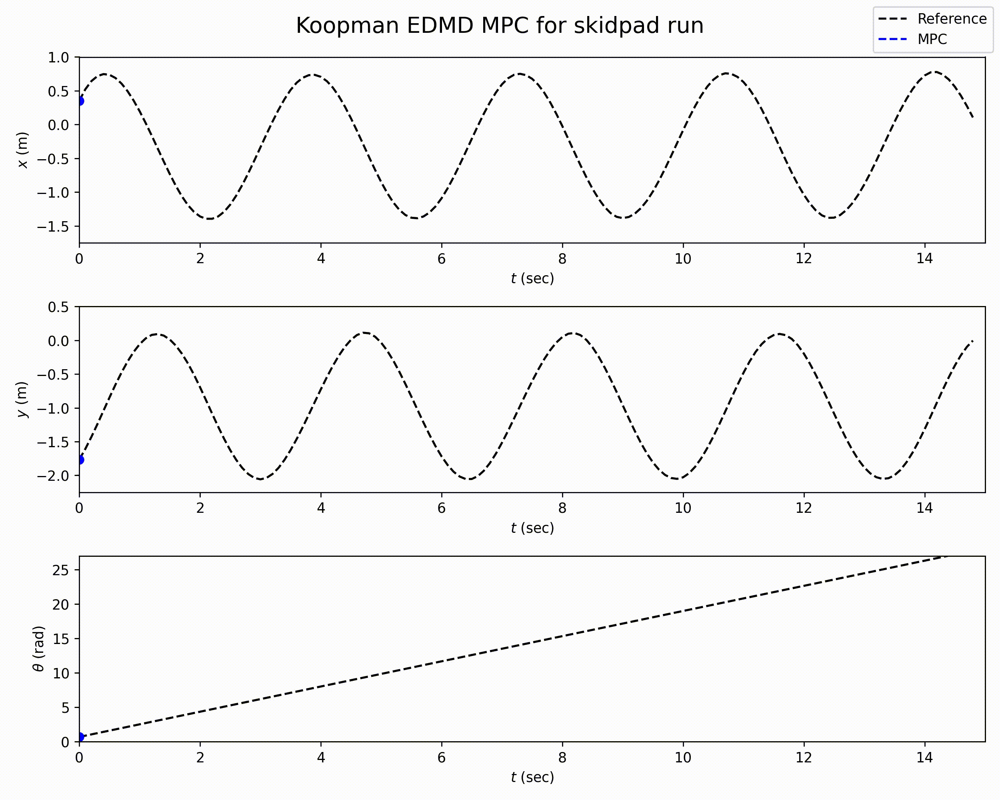

# F1Tenth KEDMD IDETC Demo
Koopman EDMD on F1Tenth data with dubins car model lifting functions demonstration. </br>
This work was submitted for IROS 2023 and is part of active research under FA1.1(Year III). </br>

### Abstract:
This work presents a data-driven framework to
discover underlying dynamics on a scaled F1TENTH vehicle
using the Koopman operator linear predictor. Traditionally, a
range of white, gray, or black-box models are used to develop
controllers for vehicle path tracking. However, these models are
constrained to either linearized operational domains, unable
to handle significant variability or lose explainability through
end-2-end operational settings. The Koopman Extended Dynamic Mode Decomposition (EDMD) linear predictor seeks
to utilize data-driven model learning whilst providing benefits
like explainability, model analysis and the ability to utilize
linear model-based control techniques. Consider a trajectory-
tracking problem for our scaled vehicle platform. We collect
pose measurements of our F1TENTH car undergoing standard
vehicle dynamics benchmark maneuvers with an OptiTrack
indoor localization system. Utilizing these uniformly spaced
temporal snapshots of the states and control inputs, a data-
driven Koopman EDMD model is identified. This model serves
as a linear predictor for state propagation, upon which an
MPC feedback law is designed to enable trajectory tracking.
The prediction and control capabilities of our framework are
highlighted through real-time deployment on our scaled vehicle. </br>



**Paper (IROS 2023)**: </br>
[Data-Driven Modeling and Experimental Validation of Autonomous
Vehicles using Koopman Operator](https://www.researchgate.net/publication/369737963_Data-Driven_Modeling_and_Experimental_Validation_of_Autonomous_Vehicles_using_Koopman_Operator)


### Repository organization

The repository is organized as follows.</br>

- **F1tenth_utils:** This folder contains all the helper files required for handoff implementation.
  - **lift_states.py**: Helper function for basis transform ("lifting") of state matrix.
  - **open_loop_response.py**: Helper function for obtaining open-loop response in the lifted space given set of control inputs.
  - **plotter_tools_ol.py**: This jupyter notebook enables plotting of open-loop response of the identified lifted model across different trajectories.
  - **koopman_edmd_ros.py**: This python file is utilized for Sim2Real on the F1tenth vehicle.


- **Matrices_saved:** In this folder, I am providing all the models which were trained and the testing data to save time from the pre-processing steps.
  - **Data_***: All the subfolders under this prefix contain data associated with different runs and pre-processing steps.
    - These folders contain 3 files: 
      - **fname**: File names of maneuvers with input speed and angle
      - **U_train.npy**: Snapshots of control inputs used
      - **X_train.npy** Snapshots of states
  - **Trained_models**:All the subfolders contain the associated trained models.
    - These folders contain 3 files.
      - **fname**: File names of maneuvers with input speed and angle
      - **U_train.npy**: Snapshots of control inputs used
      - **X_train.npy** Snapshots of states


- **Figures:** This folder contains all the plots from the research process. Sub-folders can be created for saving your own plots as will be highlighted in the code demo.
- **Videos:** Folder for storing video results from KEDMD MPC tracking.

### Implementation and usage guideline
**Quick note:** A handy way to obtain the dependencies into a  requirements.txt text file is to use the library **pipreq**.
Use the following command:
```
pipreqs *directory of your folder*
```

The main file that would be used for demos is the **IDETC_demo.ipynb** jupyter notebook.
The **IDETC_demo.ipynb** executes the following steps highlighted in the pipeline above:
Following are functions carried out by each code block in the file.
1. Import required libraries: The first code-block imports all the required libraries and dependencies.
2. Load data and associated models: From the second code-block, we can import the required dataset and any lifted model.
   ```
   # Load the data runs and select the trajectory to follow
    data_run_path = 'Matrices_saved\Data_skidpad_ccw_unsync\\' # Path where the runs are stored
    X_test = np.load(data_run_path+'X_train.npy', allow_pickle=True) # Snapshots of states
    U_test = np.load(data_run_path+'U_train.npy', allow_pickle=True) #Snapshots of control inputs
    with open(data_run_path+'fname','rb') as f:
        run_names = pickle.load(f) # Associated run names
    print(run_names)
    
    # Load model
    EDMD_mat_path='Matrices_saved\Trained_models\\skidpad_ccw_unsync\\'
    A_edmd_fro = np.load(EDMD_mat_path+'A_EDMD_fro.npy') #Lifted state matrix
    B_edmd_fro = np.load(EDMD_mat_path + 'B_EDMD_fro.npy') # Control matrix
    C_edmd = np.load(EDMD_mat_path + 'C_EDMD_fro.npy') # Output matrix
   ```
   - You can also visulize the open-loop response from the models using the helper functions:
   ```
   run_name = run_names
   plotter_tools_ol.plot_lifted_predictions(X_test,A_edmd_fro,B_edmd_fro,U_test,run_name)
   ```
   
3. Linear MPC for KEDMD model: Now that we have the dataset and models loaded, we can use the linear MPC for path tracking.

    ```
    # Step III: Linear MPC with cvxpy
    
    num = np.random.randint(0,len(X_test),1) # Randomly select any trajectory
    save_fig = 'No'
    print(num,run_names[num[0]])
    
    # Initialization
    x_ref = X_test[num[0]] # Select  any trajectory from the dataset    
    z_ref = lift_states.lift_states(x_ref) #Lift the observation snapshots to functional space
    u_ref = U_test[num[0]].T # Reference control for open-loop prediction plots
    N = 70 # Prediction horizon
    
    z_init = np.zeros((z_ref.shape[0],z_ref.shape[1])) # Init the realized trajectory
    z_init[:, 0] = z_ref[:,0]
    u_mpc = np.zeros((u_ref.shape[0],u_ref.shape[1])) # Stack of the control inputs generated by MPC
    
    
    Q = np.zeros((z_ref.shape[0],z_ref.shape[0])) # Cost matrix for lifted states
    R = np.eye(2) # Control cost
    Q[1,1] = 1; Q[2,2] = 1; Q[3,3] = 1; Q[4,4] = 1
    umin = np.array([0,-0.75]).reshape(2) # Control constraints
    umax = np.array([3,0.75]).reshape(2) # Control constraints
    count = 1
    time_count = []
    
    # Solve optimization till end of trajectory
    for count in tqdm(range(1,z_ref.shape[1] - N),desc="Loading..."): # Main loop for solver
        z_pred = cp.Variable((z_ref.shape[0], N + 1))
        u_pred = cp.Variable((u_ref.shape[0], N))
        z_ref_ = matrix(z_ref[:,count:count+N+1]) # z_ref_ is the reference window for the current iteration of the loop
        u_ref_ = matrix(u_ref[:,count-1:count+N])
        cost = 0 # Initializing cost before the loop
        constr = [] # Initializing constraint value
    
        # constr = [z_pred[:, 0] == z_init[:,count-1]]
        for i in range(N):
            if i == 0:
                cost += cp.quad_form(reshape(z_pred[:,i+1],(z_ref.shape[0],1)) - z_ref_[:,i],Q) # Quad prog required to do (x-x_ref).T@Q@(x-x_ref)
                constr += [z_pred[:, i + 1] == A_edmd_fro @ z_pred[:, i] + B_edmd_fro @ u_pred[:, i],umin <=u_pred[:,i], u_pred[:,i]<= umax]
            else:
                cost += cp.quad_form(reshape(z_pred[:,i+1],(z_ref.shape[0],1)) - z_ref_[:,i],Q) \
                        # + cp.quad_form(reshape((u_pred[:,i]-u_pred[:,i-1])/0.5,(2,1)) ,np.eye(2)*5) # Quad prog required to do (x-x_ref).T@Q@(x-x_ref)
                constr += [z_pred[:, i + 1] == A_edmd_fro @ z_pred[:, i] + B_edmd_fro @ u_pred[:, i],umin <=u_pred[:,i], u_pred[:,i]<= umax]
    
        constr += [z_pred[:, 0] == z_init[:,count-1]] # Add initial constraints
        problem = cp.Problem(cp.Minimize(cost), constr)
        problem.solve(solver=cp.SCS,verbose=False) # Solve the optimization problem with SCS solver
        u_mpc[:,count-1] = u_pred.value[:,0]
        z_init[:,count] = A_edmd_fro@z_init[:,count-1] + B_edmd_fro@u_pred.value[:,0]
    
    #Get open loop response for comparison
    x_hat_ol = simulate_ol(A_edmd_fro,B_edmd_fro,C_edmd,X_test[num[0]],U_test[num[0]]) #Obtain open loop response
    ```

4. Plot results:
In the next few code blocks, we can plot results according to the use case:
- Plot 2D graphs (The naming is filename + _plot.png):

- Plot 3D trajectory plot with z axis being the yaw of the vehicle:



- Generate .mp4 video of the trajectory plots:

